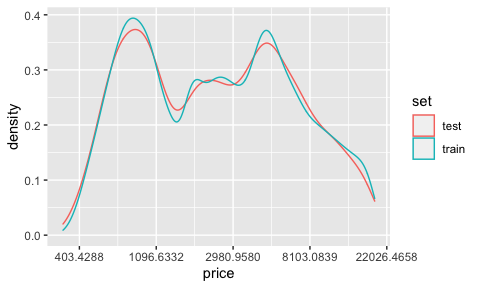
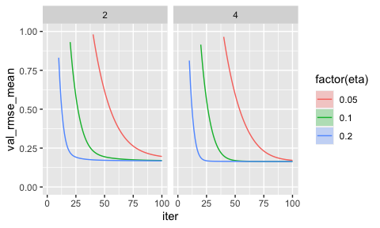
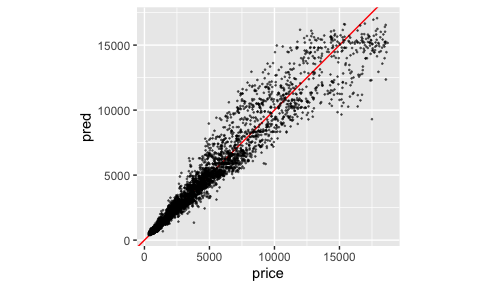
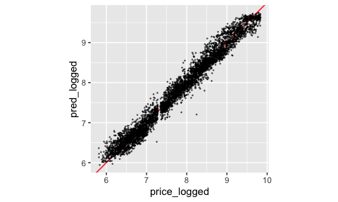
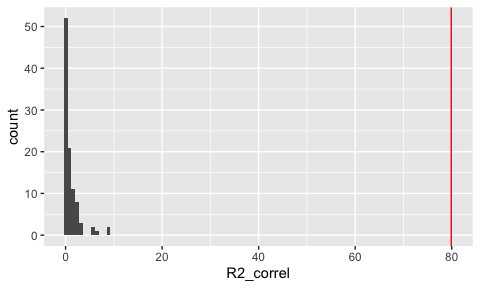
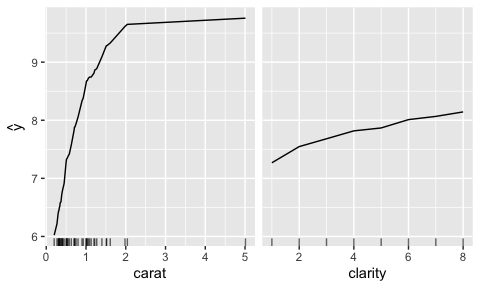

# Utilities for Machine Learning

## Installation

`jihoml` is not on CRAN. To get it from this page, install the package
`remotes` and

``` r
remotes::install_github("jiho/jihoml")
library("jihoml")
```

    # Loading required package: dplyr

    # 
    # Attaching package: 'dplyr'

    # The following objects are masked from 'package:stats':
    # 
    #     filter, lag

    # The following objects are masked from 'package:base':
    # 
    #     intersect, setdiff, setequal, union

    # Loading required package: ggplot2

## Principles

Setting up a machine learning model involves:

1.  preparing the data, which usually means splitting it between a
    training set and an evaluation/validation/testing set. This is done
    with functions `resample_***()`

2.  defining a grid of hyper-parameters to try to find the best
    combination, done with `param_grid()`

3.  fitting the model, done with `***_fit()`

4.  evaluating the fit on the validation set, to choose the best
    hyper-parameters, done with `***_summarise_fit()`

5.  predicting values of the response variable on the validation set or
    a new data set, done with `***_predict()`, and evaluating the
    quality of the fit there, done with `***_metrics()`.

6.  inspect the functioning of the model, through computation of
    variable importance (`importance()`) and/or partial dependence plots
    (`partials()`).

## Regression example

We use gradient boosting to predict the price of diamonds (un US$) based
on some of their characteristics

-   carat: weight of the diamond (0.2–5.01)
-   table: width of top of diamond relative to widest point (43–95)
-   clarity: a measurement of how clear the diamond is (I1 (worst), SI2,
    SI1, VS2, VS1, VVS2, VVS1, IF (best))
-   cut: quality of the cut (Fair, Good, Very Good, Premium, Ideal)

``` r
data("diamonds", package="ggplot2")
d <- diamonds %>% select(price, carat, table, clarity, cut)
head(d)
```

    # # A tibble: 6 × 5
    #   price carat table clarity cut      
    #   <int> <dbl> <dbl> <ord>   <ord>    
    # 1   326  0.23    55 SI2     Ideal    
    # 2   326  0.21    61 SI1     Premium  
    # 3   327  0.23    65 VS1     Good     
    # 4   334  0.29    58 VS2     Premium  
    # 5   335  0.31    58 SI2     Good     
    # 6   336  0.24    57 VVS2    Very Good

### Prepare data splits

The distribution of the response variable is not normal; we will need to
make sure that the model is trained on diamonds of various prices (not
just the most common cheap ones) and that the error metric takes this
distribution into account.

``` r
ggplot(d) + geom_histogram(aes(x=price), bins=50)
```

<!-- -->

A log transformation seems to help with the distribution of prices, so
we create a new column in the data.

``` r
ggplot(d) + geom_histogram(aes(x=price), bins=50) + scale_x_continuous(trans="log")
```

<!-- -->

``` r
d$price_logged <- log(d$price)
```

We start by separating a test set to assess our model at the end. We
stratify by price to ensure the test set contains diamonds of all prices
(and not just the most common cheap ones).

``` r
# Separate prices into bins containing approximately the same numbers of elements
d <- mutate(d, 
  price_binned=cut(price,
                   breaks=quantile(price,
                                   probs=seq(0, 1, length=6)),
                   include.lowest=TRUE)
)
count(d, price_binned)
```

    # # A tibble: 5 × 2
    #   price_binned           n
    #   <fct>              <int>
    # 1 [326,837]          10796
    # 2 (837,1.7e+03]      10784
    # 3 (1.7e+03,3.46e+03] 10789
    # 4 (3.46e+03,6.3e+03] 10783
    # 5 (6.3e+03,1.88e+04] 10788

``` r
# Split data between train (90%) and test (10%) stratified by this binned price
set.seed(1)
rs <- resample_split(d, price_binned, p=0.9)

# Check that the distribution of prices is indeed the same in the train and test
# sets
d$set <- "train"
d$set[as.integer(rs$val[[1]])] <- "test" # get indexes of the test set
ggplot(d) + geom_density(aes(x=price, colour=set)) + scale_x_continuous(trans="log")
```

<!-- -->

We have comparable training and testing data sets. We can extract them
and continue to work on the training set to fit the model.

``` r
d_train <- data.frame(rs$train)
d_test  <- data.frame(rs$val)
```

### Tune model hyperparameters

To find the best settings for the gradient boosting model (learning
rate, number of trees, depth of trees, etc.) we need to extract some
validation data from the training set. We can do this by creating a
dedicated validation set (`resample_split`), through cross-validation
(`resample_cv`) or through bootstrapping (`resample_boot`). We will use
(repeated) cross validation.

``` r
# create 4 folds and repeat this 3 times => 12 resamples
rscv <- resample_cv(d_train, price_binned, k=4, n=3)
rscv
```

    # # A tibble: 12 × 4
    #    train                   val                      fold repet
    #    <list>                  <list>                  <int> <int>
    #  1 <resample [36,411 x 7]> <resample [12,135 x 7]>     1     1
    #  2 <resample [36,409 x 7]> <resample [12,137 x 7]>     2     1
    #  3 <resample [36,411 x 7]> <resample [12,135 x 7]>     3     1
    #  4 <resample [36,407 x 7]> <resample [12,139 x 7]>     4     1
    #  5 <resample [36,409 x 7]> <resample [12,137 x 7]>     1     2
    #  6 <resample [36,410 x 7]> <resample [12,136 x 7]>     2     2
    #  7 <resample [36,410 x 7]> <resample [12,136 x 7]>     3     2
    #  8 <resample [36,409 x 7]> <resample [12,137 x 7]>     4     2
    #  9 <resample [36,410 x 7]> <resample [12,136 x 7]>     1     3
    # 10 <resample [36,409 x 7]> <resample [12,137 x 7]>     2     3
    # 11 <resample [36,412 x 7]> <resample [12,134 x 7]>     3     3
    # 12 <resample [36,407 x 7]> <resample [12,139 x 7]>     4     3

For each resample, we will try a few values of some key
hyper-parameters.

``` r
rscv_grid <- param_grid(rscv, 
  eta=c(0.2, 0.1, 0.05),  # learning rate
  max_depth=c(2,4) # tree depth
)
# 3 values for eta, 2 values for three depths, 12 resamples for each =>
# 3 * 2 * 12  = 72 models to fit
nrow(rscv_grid)
```

    # [1] 72

Fit models to all resamples, using parallel computation to speed things
up

``` r
# detect number of cores and use many (but not all) if possible
n_cores <- min(parallel::detectCores()-1,36)
system.time(
  fits <- xgb_fit(rscv_grid,
    # define response and explanatory variables
    resp="price_logged", expl=c("carat", "table", "clarity", "cut"),
    subsample=0.5,  # subsample training data to avoid over-fitting
    nrounds=100,    # train for 100 rounds (which is rather small)
    cores=n_cores   # use many cores to speed computation up
  )
)
```

    #    user  system elapsed 
    #  61.285   2.027  12.460

Examine the decrease in the fit metric (RMSE here) according to the
various hyperparameters: `eta`, `max_depth` but also `niter`, the number
of boosting rounds (or number of trees here):

``` r
xgb_summarise_fit(fits) %>% 
  ggplot() +
  facet_wrap(~max_depth) +
  # show the uncertainty in the fit
  geom_ribbon(aes(x=iter,
                  ymin=val_rmse_mean-val_rmse_sd,
                  ymax=val_rmse_mean+val_rmse_sd,
                  fill=factor(eta)), alpha=0.3) +
  # plot the decrease in error
  geom_path(aes(x=iter, y=val_rmse_mean, colour=factor(eta))) +
  # zoom on the bottom of the plot, to see differences better
  ylim(0,1)
```

    # Warning: Removed 67 row(s) containing missing values (geom_path).

<!-- -->

The variance across resamples is so low that we don’t see it on the
plot, which is good (and also mean we could have gotten away with simple
cross-validation instead of a repeated one). With only 100 trees, we do
not go into overfitting, `eta`=0.1 or 0.2 seem to be the best choice;
`max_depth` does not seem to make a difference. We will choose
`max_depth`=4, `eta`=0.1, and `niter`=75.

### Fit the model with the best hyperparameters

Now we fit the model on the full training set

``` r
fit <- xgb_fit(rs,
  resp="price_logged", expl=c("carat", "table", "clarity", "cut"),
  subsample=0.5,
  max_depth=4, eta=0.1, nrounds=75,
  threads=n_cores
)
```

### Assess performance on the test set

The test set is the `val` component of the original `rs` split, on which
we fitted the final model, so we can just predict that and compute
performance metrics on it.

``` r
d_test <- xgb_predict(fit)
regression_metrics(d_test$pred, d_test$price_logged)
```

    # # A tibble: 1 × 5
    #    RMSE   MAE    R2 R2_correl R2_correl_log1p
    #   <dbl> <dbl> <dbl>     <dbl>           <dbl>
    # 1 0.163 0.128  97.4      97.4            97.3

So the model predicts the test data very well. But the prediction is in
the scale the model was fitted in (i.e. log-transformed, which squashes
high prices). Let us put it back in its original scale and examine if
the fit is still as good.

``` r
# convert in original scale (but keep the logged result)
d_test <- mutate(d_test,
  pred_logged=pred,
  pred=exp(pred)
)
# recompute metrics
regression_metrics(d_test$pred, d_test$price)
```

    # # A tibble: 1 × 5
    #    RMSE   MAE    R2 R2_correl R2_correl_log1p
    #   <dbl> <dbl> <dbl>     <dbl>           <dbl>
    # 1  938.  520.  94.3      94.3            97.4

As expected, the R2 decreased (but not very much); `R2_correl_log1p` is
similar to the previous `R2_correl` (not exactly the same since
`R2_correl_log1p` uses log(n+1) and we used log() above). We can examine
the predicted vs true prices:

``` r
ggplot(d_test) + 
  geom_abline(aes(slope=1, intercept=0), colour="red") +
  geom_point(aes(x=price, y=pred), size=0.2, alpha=0.5) +
  coord_fixed()
```

<!-- -->

The spread in high prices (hence heteroskedasticity) is also due to the
log transformation. In the space in which the model was fitted
(i.e. with the log transformation), the residuals are very well
distributed.

``` r
ggplot(d_test) + 
  geom_abline(aes(slope=1, intercept=0), colour="red") +
  geom_point(aes(x=price_logged, y=pred_logged), size=0.2, alpha=0.5) +
  coord_fixed()
```

<!-- -->

Although we have a very good fit, we may want to assess how different it
is from a random fit. To do so, we can perform permutations of the
response with respect to the predictors and compute the performance
metrics on these permutations.

``` r
# prepare 100 permutations of the training data
perm <- rs %>% 
  replicate(n=100) %>% 
  permute(resp="price_logged")
nrow(perm)
```

    # [1] 100

``` r
# fit a model for each permutation
fitted_perm <- xgb_fit(perm,
  resp="price_logged", expl=c("carat", "table", "clarity", "cut"),
  subsample=0.5,
  max_depth=4, eta=0.1, nrounds=75,
  cores=n_cores
)
# predict each permutation
pred_perm <- fitted_perm %>%
  # keep trace of the replicate
  group_by(replic) %>% 
  # predict and do not average
  xgb_predict(fns=NULL)

# compute metrics for each permutation
metrics_perm <- pred_perm %>%
  group_by(replic) %>%
  summarise(regression_metrics(pred, price_logged))

# get the metrics on the actual data
metrics_ref <- regression_metrics(d_test$pred, d_test$price_logged)

# compare both
ggplot() +
  geom_histogram(aes(x=R2_correl), data=metrics_perm, bins=100) +
  geom_vline(aes(xintercept=R2_correl), data=metrics_ref, colour="red")
```

<!-- -->

So clearly, our model (red line) is better than random ones (histogram)!

### Examine the effects of predictors

Now that we are confident that the model is good, we can inspect the
role of the four predictors.

``` r
importance(fit) %>% summarise_importance()
```

    # # A tibble: 4 × 7
    #   Feature Gain_mean Gain_sd Cover_mean Cover_sd Frequency_mean Frequency_sd
    #   <fct>       <dbl>   <dbl>      <dbl>    <dbl>          <dbl>        <dbl>
    # 1 table    0.000435      NA     0.0910       NA          0.116           NA
    # 2 cut      0.00272       NA     0.105        NA          0.111           NA
    # 3 clarity  0.0234        NA     0.273        NA          0.322           NA
    # 4 carat    0.973         NA     0.531        NA          0.451           NA

By far, the most relevant variable to predict price is the weight of the
diamond (carat), which contributes to 97% of the explained variance. The
second (but far below, at 2%) is the clarity of the diamond. Note that
the standard deviations are 0 since we are using a single model.

Examine the shape of the effect of those variables through partial
dependence plots

``` r
partials(fit, expl=c("carat", "clarity"), quantiles=TRUE, probs=(0:50)/50) %>% 
  plot_partials()
```

<!-- -->

We see that price goes up with both carat and clarity, but for large
diamonds, the increase in price with carat is not linear anymore. Note
that clarity is now a numeric variable while it originally was a factor
with those levels: I1, SI2, SI1, VS2, VS1, VVS2, VVS1, IF; this is a
side effect of the `xgboost` library, which needs all numeric matrices
as input.

*The end*
